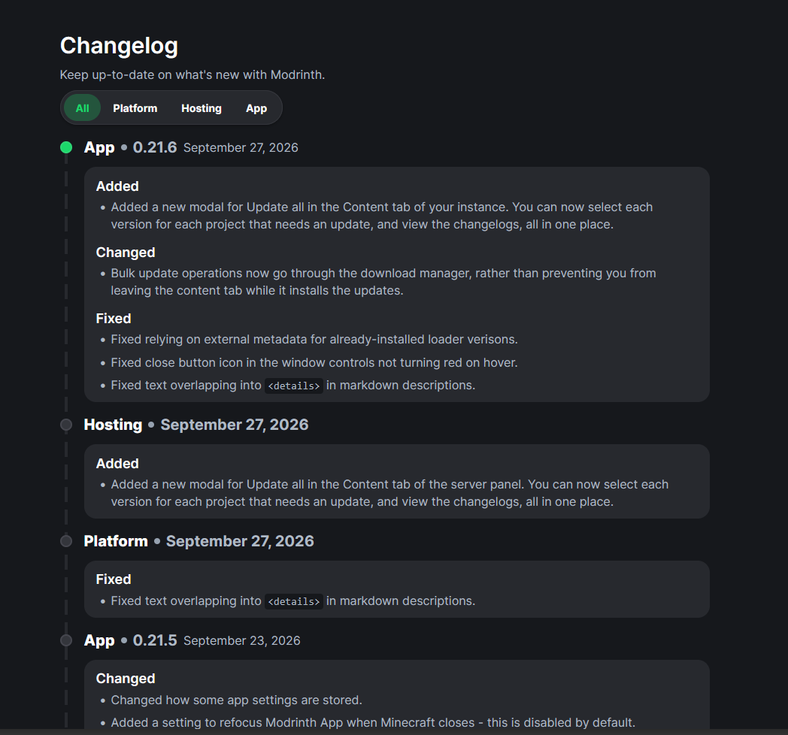
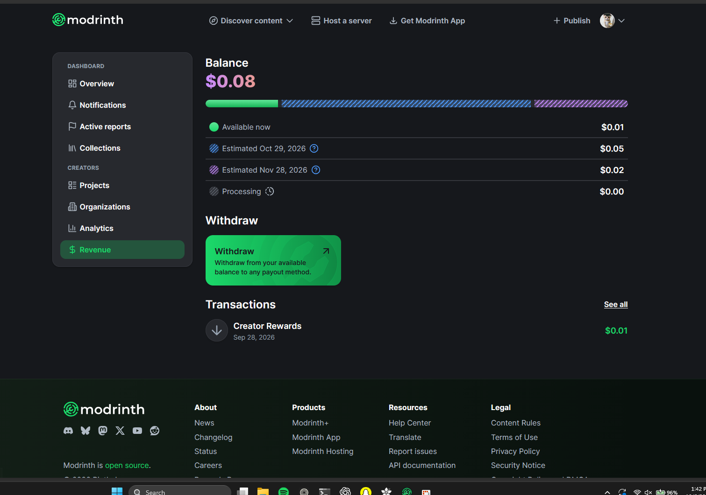

# Professional Interface Reference Library

These approved references document reusable design reasoning for future Bloom work. They are examples of quality and structure, never templates to reproduce one-for-one.

## Reference 1: Structured changelog

This screenshot is an approved **quality reference**, not a layout to reproduce one-for-one. Future Bloom work should study why it feels deliberate and then translate those principles into Bloom's content, navigation model, blue accent, typography, and components.

## Why this interface feels finished

The design is confident because every visual choice explains the information. It does not rely on background art, gradients, blur, glow, oversized decoration, or motion to create interest.

- The page has one clear reading column with controlled empty space around it.
- The title and short description establish the page before any controls appear.
- The filter is compact and visually grouped, but it does not dominate the content.
- The timeline provides a persistent structural spine. Entries feel connected without being placed inside one enormous container.
- Each update has two layers: metadata on the page surface, then detailed changes on a raised surface below it.
- Repetition creates rhythm. The repeated entry pattern makes a long page easier to scan rather than making it feel duplicated.
- The accent color identifies the active filter and current timeline point. It is not painted across every interactive element.
- Text carries most of the hierarchy. Borders and surface changes support it instead of trying to replace it.

## Composition

### Constrained working column

The content does not span the full window. A readable maximum width keeps lines, filters, timeline markers, and cards visually related.

Use this approach when a page is primarily read or scanned:

- changelogs;
- activity history;
- release history;
- logs with grouped events;
- status timelines;
- audit or synchronization history.

Do not automatically use it for a launcher home screen, large visual gallery, dense settings form, or split-pane workspace.

### Strong opening block

The page begins with:

1. a direct title;
2. one short sentence describing the page;
3. the most relevant local control.

The opening does not include a promotional paragraph, badge collection, decorative icon, or repeated product name. The user understands the page before reaching the first entry.

### Timeline as layout, not decoration

The vertical line is useful because it:

- establishes chronology;
- aligns every release marker;
- visually connects separated cards;
- lets entries have different heights without losing the page structure.

A Bloom adaptation can use a timeline for releases, downloads, sync history, or update history. It should not be added to unrelated cards merely because the line looks good.

## Surface hierarchy

The reference uses a small, disciplined surface system:

- **Page:** dark charcoal rather than featureless black.
- **Raised content:** a lighter charcoal that separates details from the page.
- **Controls:** compact dark surfaces with one clear selected state.
- **Lines:** low-contrast dividers that organize without framing everything.
- **Accent:** reserved for current state, not general decoration.

For Bloom, translate this into existing tokens. Do not sample and reuse the reference's exact colors. OLED-black Bloom screens may keep the outer page black while using slightly lifted, solid surfaces for entries.

Avoid:

- gradients and radial lighting;
- blurred or translucent “glass” cards;
- glow around active elements;
- multiple nested card shades with no semantic meaning;
- bright outlines around every container;
- shadows used as decoration instead of depth;
- large empty cards whose only purpose is to fill space.

## Typography

The typography succeeds through contrast in role, not through many font styles.

- The page title is large enough to anchor the page but not hero-sized.
- Entry titles are bold and compact.
- Versions and dates remain on the same baseline as the entry identity.
- Section verbs such as **Added**, **Changed**, and **Fixed** are short subheadings.
- Body copy is calmer, slightly muted, and comfortable across multiple lines.
- Inline code has a distinct surface because it is a different kind of content.

Bloom adaptations should keep the locally bundled Fredoka family where the website uses it, but must control its roundness with sensible weights and sizes. Do not turn every label into heavy display text. Body text should remain quiet enough for the hierarchy to work.

## Spacing and density

The interface is neither sparse nor cramped.

- Related metadata sits close together.
- The gap between an entry header and its detail card is smaller than the gap between releases.
- Card padding is generous enough for multi-line notes but does not make every entry enormous.
- Bullets use consistent indentation and line spacing.
- The timeline marker aligns with the release heading, not the card center.
- The filter stays near the page introduction because it affects the content immediately below it.

The main lesson is **relational spacing**: use small gaps inside one idea, medium gaps between parts of an entry, and large gaps between separate page regions.

## Interaction

The screenshot communicates several interaction rules even in a still frame:

- The selected filter is obvious without a heavy glow.
- Unselected filters remain readable and clearly clickable.
- The current release marker differs from older markers.
- Cards do not need to lift or scale on hover.
- The chronological content remains readable without opening accordions.

For Bloom:

- use color and restrained surface changes for hover and focus;
- keep controls stationary;
- make active state visible with accent fill, text, or a marker;
- preserve keyboard focus;
- do not hide important release notes behind hover;
- use animation only when it explains a real state transition.

## Responsive translation

On a narrow screen:

- keep the page title and filter in normal document flow;
- preserve the timeline to the left of content when there is enough room;
- otherwise reduce the timeline gutter before removing it;
- allow metadata to wrap cleanly rather than shrink into unreadable text;
- keep card padding proportional;
- never create horizontal scrolling for release copy;
- keep filters reachable through wrapping or a horizontally scrollable control row with visible affordance.

Desktop spacing must not be copied directly to mobile. The hierarchy should survive even when the composition changes.

## Adapt, do not copy

A valid Bloom adaptation changes the content model and visual expression while keeping the underlying quality principles.

Good adaptation:

- Bloom blue replaces the reference accent.
- Bloom tokens determine surfaces, borders, type, and corner radii.
- Categories reflect Bloom's actual release areas.
- Timeline entries use Bloom versions and real dates.
- The page keeps Bloom navigation and footer behavior.
- Components are sized for Bloom's information density.

Copying too literally:

- reproducing the same filter names;
- matching exact colors, dimensions, radii, or marker shapes;
- copying the exact timeline/card geometry without checking Bloom's content;
- reusing the same wording or release organization;
- adding a timeline to a screen where chronology is not the primary relationship;
- treating this screenshot as a template instead of evidence of good design reasoning.

## Reference 1 review checklist

Before approving a related Bloom design, verify:

- [ ] The page has one unmistakable primary purpose.
- [ ] The opening title, description, and first control form a clear group.
- [ ] The main visual structure represents the data relationship.
- [ ] Surface changes have semantic meaning.
- [ ] The accent appears only where it helps identify state or priority.
- [ ] Typography establishes hierarchy before decoration is added.
- [ ] Repeated content follows one predictable rhythm.
- [ ] Body text remains readable at the expected width.
- [ ] Hover and focus do not move the layout.
- [ ] There are no decorative gradients, blurs, glows, or filler cards.
- [ ] The design works at desktop and minimum supported width.
- [ ] Every visible control performs a real action.
- [ ] The result feels like Bloom rather than a reskinned copy of the reference.
## Reference 2: Structured dashboard workspace

This is an approved reference for dashboards, account areas, administrative workspaces, settings hubs, analytics, and other pages with several related destinations. It demonstrates how to make a functional interface feel substantial without turning every section into a floating card.

### Why this interface feels complete

- The page has three clear regions: global navigation, a local dashboard sidebar, and the current workspace.
- The local sidebar groups destinations by purpose and makes the active destination unmistakable.
- The main content sits directly on the page instead of inside one giant dashboard card.
- Values, labels, progress, and actions share deliberate alignment lines.
- The bright action is localized to the task that needs attention; it does not compete with navigation.
- The footer is treated as its own complete information region rather than a thin legal afterthought.
- Icons, text, dividers, and surfaces use one consistent visual vocabulary.
- Empty space separates systems and improves scanning instead of being filled with decoration.

### Information architecture

The most important lesson is the division between **global navigation** and **local navigation**.

Global navigation answers: “Where am I in the product?”

Local navigation answers: “Which area of this workspace am I viewing?”

This pattern works for:

- account and profile centers;
- creator or project dashboards;
- launcher settings with several durable categories;
- analytics, downloads, revenue, or moderation workspaces;
- team and organization administration;
- support dashboards with multiple tools.

It is unnecessary for one-step pages, landing heroes, compact modals, and focused setup flows. Do not add a sidebar when the user has only two or three actions.

### Local sidebar

The sidebar succeeds because it is a compact navigation instrument, not a second application shell.

- Category labels divide destinations into understandable groups.
- Every destination has one consistent icon and one direct label.
- The selected item receives a solid semantic surface spanning the full row.
- Unselected rows remain quiet and do not each become separate pills.
- Sidebar padding is generous, but the rows themselves remain efficient.
- The sidebar ends naturally with its last relevant destination; it does not stretch content merely to match the page height.

For Bloom, use existing navigation and surface tokens. Do not copy these category names, green selection color, sidebar width, or exact radius.

### Main workspace

The main content is mostly flat. That restraint makes the few raised or colored elements matter.

- A direct section heading opens each content region.
- The primary value has stronger typography and a semantic color.
- A segmented status bar explains proportions with the same colors used in its legend.
- Legend rows align descriptions at left and values at right.
- Dividers replace unnecessary enclosing cards.
- The primary action is given its own compact block close to the data it affects.
- The transaction row is a simple aligned record rather than another large card.

This is a useful pattern for Bloom settings summaries, download state, instance storage, account details, synchronization status, and diagnostic results.

### Alignment and rhythm

The page feels designed because unrelated components still respect shared geometry.

- The main heading, progress bar, legend, action block, and transaction list begin from the same left edge.
- Monetary values share one right edge.
- Sidebar icons share one column and labels share another.
- Section spacing is larger than row spacing.
- Dividers extend across the working region and create rhythm without outlining it.
- Compact data rows preserve enough vertical space to stay readable.

Before adding decoration, establish these alignment lines. A perfectly styled card cannot rescue inconsistent geometry.

### Semantic color

Color communicates meaning:

- one accent identifies available or active state;
- additional colors distinguish future or processing states;
- the action uses a strong color because it performs the main operation;
- neutral gray represents inactive or unresolved state.

Bloom should use its own blue accent and documented semantic colors. Do not recolor an entire dashboard merely because the reference uses green. Multiple colors are appropriate only when users must distinguish real categories or states.

### Action emphasis

The Withdrawal block is visually strong because it is one clear task, not because every button is oversized.

A Bloom adaptation should:

- give the main action a clear location near the information it changes;
- use one direct verb;
- include only the short consequence needed to understand the action;
- keep secondary links and rows quieter;
- avoid multiple equally bright calls to action in one viewport.

### Footer as a real region

The footer works because it closes the page with useful structure:

- brand and social destinations occupy one column;
- product, resource, company, and legal destinations use labeled groups;
- the footer surface is visibly separate from the dashboard;
- link density is high, but alignment makes it manageable.

For Bloom's website, use this idea only when enough real destinations exist. Never invent pages, careers, products, legal links, or social profiles just to make a footer appear fuller.

### Responsive translation

At smaller widths:

- keep global navigation usable before preserving the dashboard sidebar;
- collapse or stack the local sidebar into a compact category navigation;
- preserve the active destination label;
- allow aligned data rows to stack only when the right value would collide;
- keep progress legends associated with the bar;
- move footer columns into a deliberate two-column or single-column order;
- never create horizontal page scrolling.

For the desktop client, minimum window width must preserve the local navigation and main task without shrinking labels below readable sizes.

### Adapt, do not copy

Good adaptation:

- Uses Bloom's real categories and actual information model.
- Applies Bloom surface, radius, type, and accent tokens.
- Chooses a local sidebar only when the workspace has durable peer destinations.
- Uses aligned flat rows for comparable data.
- Gives one consequential action clear emphasis.
- Builds footer groups only from real destinations.

Copying too literally:

- Reproducing the exact top navigation, sidebar categories, revenue layout, or footer columns.
- Copying the green, purple, or striped status treatment without matching Bloom data.
- Adding a balance, analytics panel, or transaction list that Bloom does not have.
- Wrapping every Bloom page in the same dashboard sidebar.
- Using the exact dimensions, spacing, radii, or icon placement without testing Bloom content.
- Filling the footer with placeholder links.

## Reference 2 review checklist

- [ ] Global and local navigation have distinct jobs.
- [ ] The active local destination is immediately visible.
- [ ] Sidebar categories reflect the actual information architecture.
- [ ] Main content aligns to a small number of shared edges.
- [ ] Comparable values share one alignment column.
- [ ] Flat rows and dividers are used before adding more cards.
- [ ] Color communicates real state or priority.
- [ ] One primary action is stronger than surrounding actions.
- [ ] The layout remains useful without decorative effects.
- [ ] The footer contains only genuine destinations.
- [ ] Narrow and minimum-width layouts preserve hierarchy.
- [ ] The result follows Bloom's system rather than reproducing Modrinth's dashboard.
